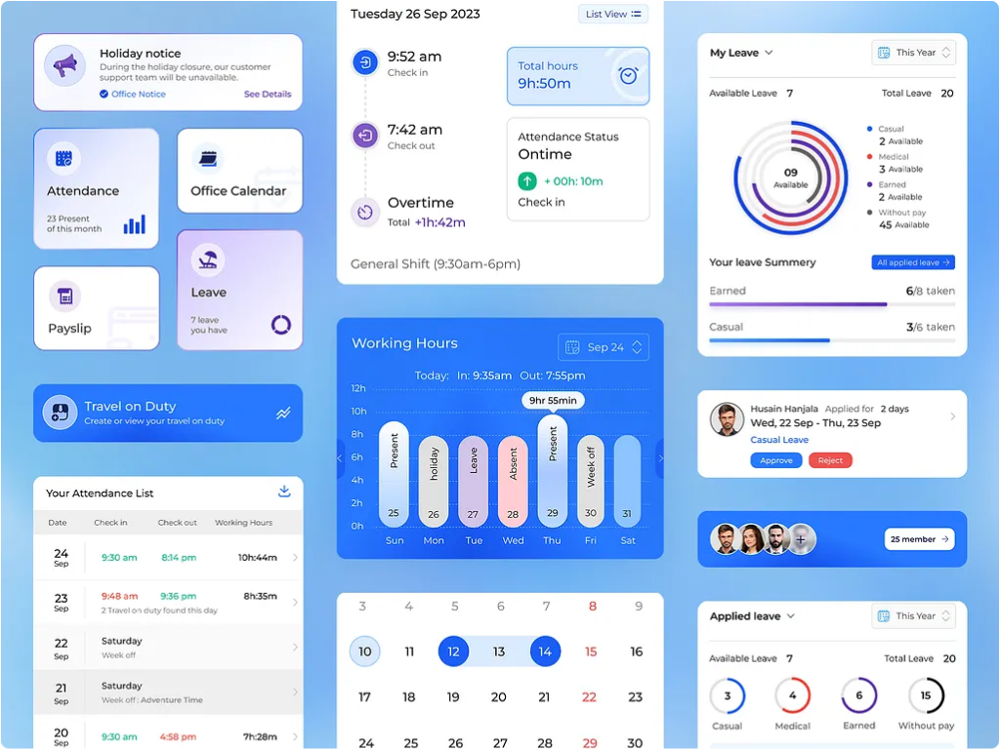
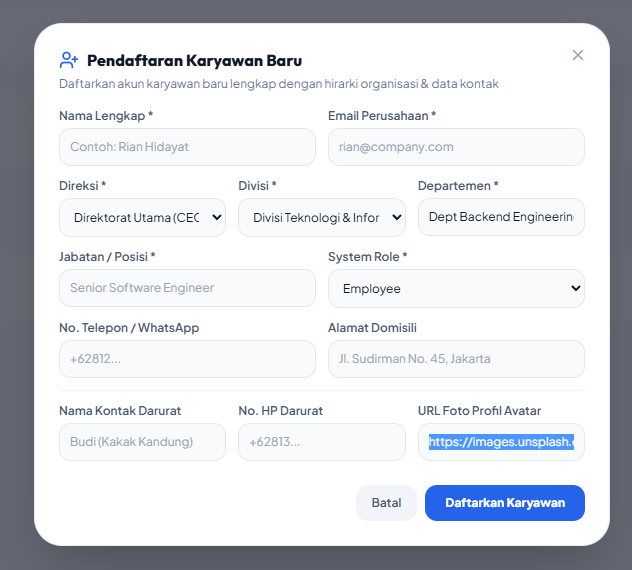
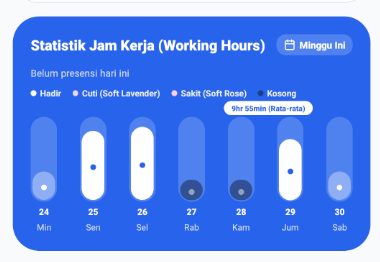

# 🏢 BlueHR Enterprise - Smart Human Resource System

> **Sistem Manajemen SDM, Presensi Geofencing GPS Real Device, Biometrik, Multi-Level Approval Cuti, dan Struktur Organisasi Terintegrasi.**



---

## 🌟 Fitur Utama (Key Features)

### 1. 🎯 Presensi Geofencing GPS Real Device & Simulasi

- **Deteksi GPS Real**: Menggunakan HTML5 Geolocation & Haversine Distance Formula untuk menghitung jarak presesi real-time karyawan terhadap koordinat kantor pusat (-6.2088, 106.8456).
- **Mode Testing Simulator**: Tombol simulasi jarak aman (`1.2 km`) dan luar radius (`6.5 km`) untuk pengujian.

### 2. 🔐 Keamanan & Biometrik Presensi

- **Verifikasi Biometrik (FaceID / Sidik Jari)**: Otentikasi lokal sebelum melakukan presensi untuk mencegah kecurangan.
- **Deteksi Rooted / Jailbroken Device**: Memeriksa integritas perangkat Android/iOS dan mendeteksi alat _mock location_ untuk mencegah GPS spoofing.

### 3. 📝 Sistem Pengajuan Cuti Multi-Level Approval

- **Alur Persetujuan Bertingkat**:
  - **Status PENDING**: Mengisi permohonan cuti.
  - **Level 1 Approval (`APPROVED_L1`)**: Persetujuan oleh Manager Departemen.
  - **Level 2 Final Approval (`APPROVED`)**: Persetujuan final oleh HR Lead / Direksi.
- **Kalkulasi Kuota Otomatis**: Memotong kuota cuti tahunan karyawan (`leave_quota`) secara dinamis.

### 4. 🏢 Hirarki Struktur Organisasi 4-Tingkat

- **Struktur Korporasi**: Direksi / Board of Directors ➔ Divisi ➔ Departemen ➔ Karyawan (NIP: `EMP-XXXX`).
- **Tim Se-Departemen**: Widget `TeamMembersRibbon` menampilkan rekan se-departemen melalui endpoint `/api/v1/team`.

### 5. 📢 Pengumuman Perusahaan & Notifikasi Real-Time

- Modul pembuatan pengumuman dari Web HR yang secara otomatis menyiarkan notifikasi ke aplikasi Mobile.

### 6. 📊 Laporan Unit Test HTML Interaktif

- Eksekusi `npm run test:report` menghasilkan laporan test HTML interaktif yang dapat dibuka langsung di browser:
  - 🌐 [Backend Test HTML Report](backend/test-report.html)
  - 🌐 [Web Test HTML Report](web/test-report.html)
  - 🌐 [Mobile Test HTML Report](mobile/test-report.html)

---

## 📸 Tangkapan Layar Aplikasi (App Screenshots)

<p align="center">
  
  <br>
  <em>Dashboard HR Enterprise Web & Statistik Presensi</em>
</p>

<p align="center">
  
  
  <br>
  <em>Presensi Geofencing GPS Real Device & Pengajuan Cuti Mobile App</em>
</p>

---

## 🏗️ Arsitektur Monorepo & Teknologi

```
blue-hr/
├── backend/            # Express.js REST API + SQLite3 Database
│   ├── src/routes/     # Auth, Attendance, Leave, Announcements, Team APIs
│   └── src/tests/      # Vitest Unit Tests
├── web/                # React 18 + Vite + Tailwind CSS + Lucide Icons
│   ├── src/pages/      # Dashboard, Employees, Attendance, Leave, Payroll
│   └── src/services/   # Biometrics, Security, & Analytics
└── mobile/             # React Native + Expo (SDK 51) + Feather Icons
    ├── src/components/ # Dashboard Widgets, Modals, Location Simulator
    └── src/screens/    # Beranda, Geofence, Cuti, Profil Saya
```

---

## 🚀 Panduan Memulai (Getting Started)

### Prasyarat

- **Node.js**: v18.0.0 atau lebih baru
- **npm**: v9.0.0 atau lebih baru

### Instalasi Dependensi

```bash
# Clone repositori
git clone https://github.com/username/blue-hr.git
cd blue-hr

# Install dependensi backend, web, dan mobile
npm run install:all # atau install di masing-masing direktori
```

### Menjalankan Server Pengembangan (Development Mode)

```bash
# 1. Jalankan Backend API & Web Dashboard secara bersamaan
npm run dev

# 2. Jalankan Mobile App di Android Emulator
npm run dev:android

# 3. Jalankan Aplikasi Web saja
npm run dev:web

# 4. Jalankan API Backend saja
npm run dev:backend
```

### Menjalankan Unit Tests & Laporan HTML Browser

```bash
# Menjalankan seluruh Unit Tests (26 Tests Passed)
npm run test

# Menghasilkan Laporan HTML Interaktif di Browser
npm run test:report
```

---

## 📄 Lisensi

Hak Cipta © 2026 **BlueHR Enterprise**. Diterbitkan di bawah Lisensi MIT.
