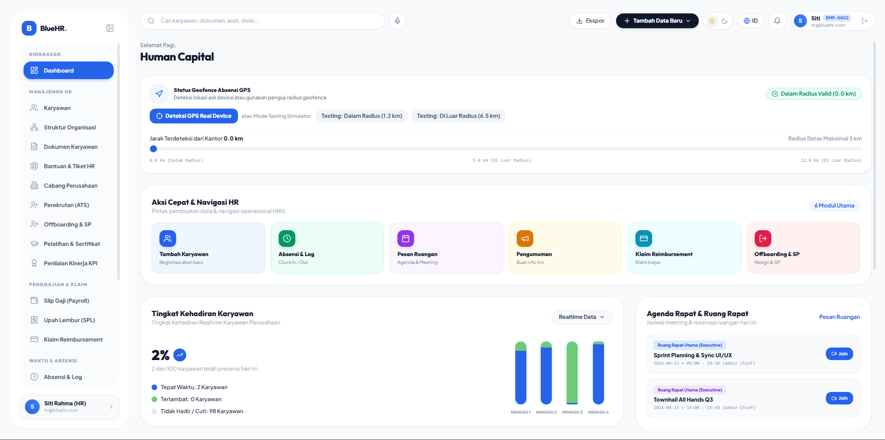
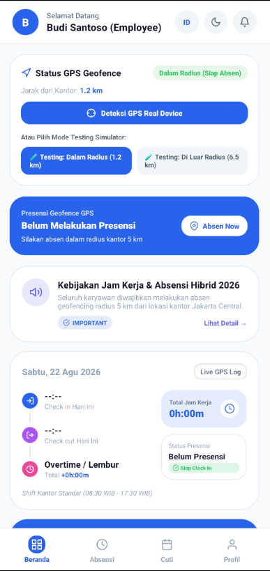

# 🏢 BlueHR Enterprise - Smart Human Resource System

> **Sistem Manajemen SDM, Presensi Geofencing GPS Real Device, Biometrik, Multi-Level Approval Cuti, dan Struktur Organisasi Terintegrasi.**



---

## 🌟 Fitur Utama (Key Features)

### 1. 🎯 Presensi Geofencing GPS Real Device & Simulasi
- **Deteksi GPS Real**: Menggunakan HTML5 Geolocation & Haversine Distance Formula untuk menghitung jarak presensi real-time karyawan terhadap koordinat lokasi kantor.
- **Mode Testing Simulator**: Tombol simulasi jarak aman (`1.2 km`) dan luar radius (`6.5 km`) untuk pengujian tanpa perlu berpindah lokasi.

### 2. 🔐 Keamanan & Biometrik Presensi
- **Verifikasi Biometrik (FaceID / Sidik Jari)**: Otentikasi lokal perangkat sebelum melakukan presensi masuk/pulang.
- **Deteksi Rooted / Jailbroken Device & Mock Location**: Memeriksa integritas perangkat Android/iOS serta mendeteksi alat _mock location_ untuk mencegah GPS spoofing.
- **Keamanan Berbasis Peran (RBAC)**: Kontrol akses ketat berbasis izin per fungsi (Role & Fine-Grained Permissions) dan otentikasi JWT / HttpOnly Cookie.

### 3. 📝 Sistem Pengajuan Cuti Multi-Level Approval
- **Alur Persetujuan Bertingkat**:
  - **Status PENDING**: Pengajuan permohonan cuti oleh karyawan.
  - **Level 1 Approval (`APPROVED_L1`)**: Review dan persetujuan oleh Manager Departemen.
  - **Level 2 Final Approval (`APPROVED`)**: Persetujuan akhir oleh HR Lead / Direksi.
- **Kalkulasi Kuota Otomatis**: Pemotongan kuota cuti tahunan (`leave_quota`) secara otomatis dan dinamis.

### 4. 💰 Payroll & Penggajian Terintegrasi
- **Kalkulasi Slip Gaji Automated**: Perhitungan otomatis Gaji Pokok, Tunjangan, Potongan, BPJS Ketenagakerjaan, BPJS Kesehatan, dan PPh 21.
- **Status Pembayaran & Export**: Manajemen siklus penggajian bulanan dengan perincian lengkap dan riwayat slip gaji karyawan.

### 5. 🧾 Pengajuan Reimbursement & Klaim Biaya
- **Klaim Biaya Operasional**: Pengajuan reimbursement medis, perjalanan dinas, dan biaya operasional lengkap dengan lampiran bukti nota.
- **Persetujuan Multi-Status**: Verification flow oleh Finance & HR dari status pengajuan hingga dicairkan.

### 6. ⏰ Pengelolaan Lembur (Overtime) & Shift Kerja
- **Pengajuan Lembur (Overtime)**: Modul lembur dengan estimasi kompensasi dan approval dari pengawas.
- **Manajemen Shift & Penukaran Shift (Shift Swap)**: Pengaturan pola kerja shift karyawan serta fasilitas penukaran jadwal shift antar rekan kerja.

### 7. 🏢 Hirarki Struktur Organisasi & Kartu Pegawai Digital
- **Struktur Korporasi 4-Tingkat**: Direksi / Board of Directors ➔ Divisi ➔ Departemen ➔ Karyawan (NIP: `EMP-XXXX`).
- **Interactive Org Chart & Team Ribbon**: Visualisasi bagan organisasi serta widget anggota tim se-departemen.
- **Kartu Pegawai Digital (Digital ID Card)**: QR Code ID Pegawai digital untuk identifikasi cepat.

### 8. 📊 Penilaian Kinerja (KPI) & Manajemen Aset/Dokumen
- **Evaluasi KPI (Key Performance Indicator)**: Monitoring target kinerja dan skor evaluasi berkala karyawan.
- **Inventaris Aset & Repositori Dokumen**: Pelacakan aset kantor yang dipinjamkan serta repositori dokumen resmi/sertifikat karyawan.

### 9. 📢 Pengumuman, Helpdesk, Kunjungan Lapangan & Pelatihan
- **Diseminasi Pengumuman Real-Time**: Siaran informasi penting ke Web Dashboard dan Aplikasi Mobile.
- **Helpdesk & Field Visit**: Tiket pertanyaan/keluhan HR serta pelacakan kunjungan kerja luar kantor.
- **Pelatihan Karyawan (Trainings)**: Pendaftaran dan modul pengkaderan/pelatihan internal perusahaan.

### 10. 📊 Laporan Unit Test HTML Interaktif
- **Pengujian Otomatis Seluruh Layer**:
  - 🌐 [Backend Test HTML Report](backend/test-report.html)
  - 🌐 [Web Test HTML Report](web/test-report.html)
  - 🌐 [Mobile Test HTML Report](mobile/test-report.html)

---

## 📸 Tangkapan Layar Aplikasi (App Screenshots)

<p align="center">
  
  <br>
  <em>Dashboard HR Enterprise Web & Status GPS Geofencing</em>
</p>

<p align="center">
  
  <br>
  <em>Aplikasi Mobile Presensi Geofencing GPS Real Device</em>
</p>

---

## 🏗️ Arsitektur Monorepo & Teknologi

```
blue-hr/
├── backend/            # Express.js REST API + SQLite3 Database
│   ├── src/routes/     # Auth, Attendance, Leave, Announcements, Team APIs
│   └── src/tests/      # Vitest Unit Tests
├── web/                # React 18 + Vite + Tailwind CSS + Lucide Icons
│   ├── src/pages/      # Dashboard, Employees, Attendance, Leave, Payroll
│   └── src/services/   # Biometrics, Security, & Analytics
└── mobile/             # React Native + Expo (SDK 51) + Feather Icons
    ├── src/components/ # Dashboard Widgets, Modals, Location Simulator
    └── src/screens/    # Beranda, Geofence, Cuti, Profil Saya
```

---

## 🚀 Panduan Memulai (Getting Started)

### Prasyarat

- **Node.js**: v18.0.0 atau lebih baru
- **npm**: v9.0.0 atau lebih baru

### Instalasi Dependensi

```bash
# Clone repositori
git clone https://github.com/username/blue-hr.git
cd blue-hr

# Install dependensi backend, web, dan mobile
npm run install:all # atau install di masing-masing direktori
```

### Menjalankan Server Pengembangan (Development Mode)

```bash
# 1. Jalankan Backend API & Web Dashboard secara bersamaan
npm run dev

# 2. Jalankan Mobile App di Android Emulator
npm run dev:android

# 3. Jalankan Aplikasi Web saja
npm run dev:web

# 4. Jalankan API Backend saja
npm run dev:backend
```

### Menjalankan Unit Tests & Laporan HTML Browser

```bash
# Menjalankan seluruh Unit Tests (26 Tests Passed)
npm run test

# Menghasilkan Laporan HTML Interaktif di Browser
npm run test:report
```

---

## 📄 Lisensi

Hak Cipta © 2026 **BlueHR Enterprise**. Diterbitkan di bawah Lisensi MIT.
